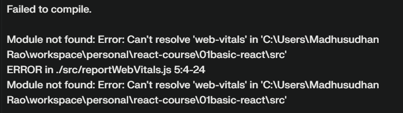

# React Js

## 1. Creating React App
create react app: npx create-react-app
creating takes time because it installs the libraries while creating.

using vite: npm create vite@latest
creates instantly because it doesn't install libraries while creating.

## Rules/conventions:
1. The component file name and component function name should start with capital letters.

## Resources:
1. [useState](https://react.dev/reference/react/useState)

## ERROR:
1. 
Solution:
npm install --save-dev web-vitals

